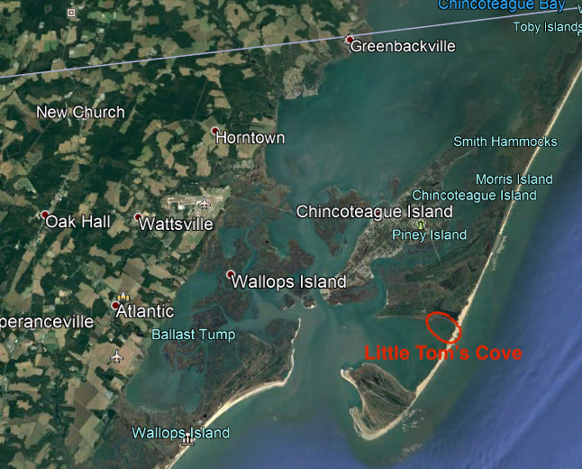
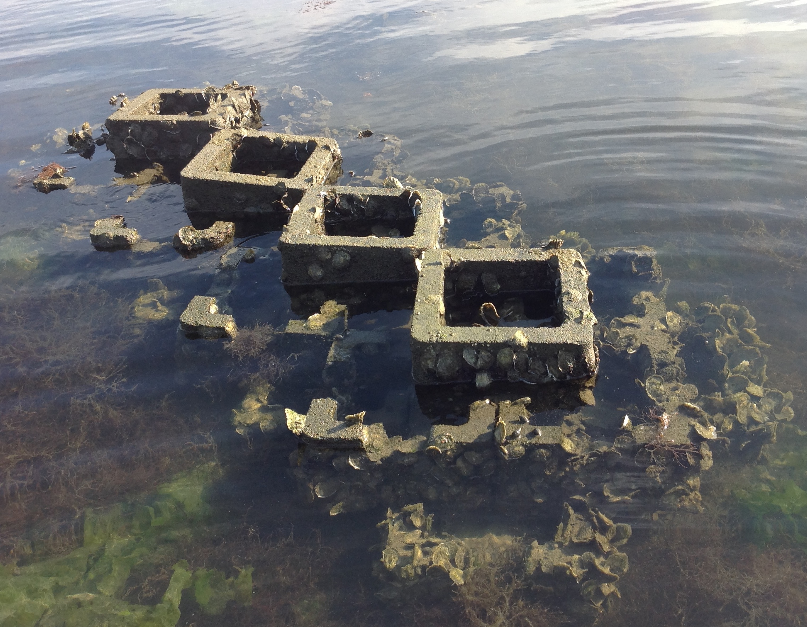
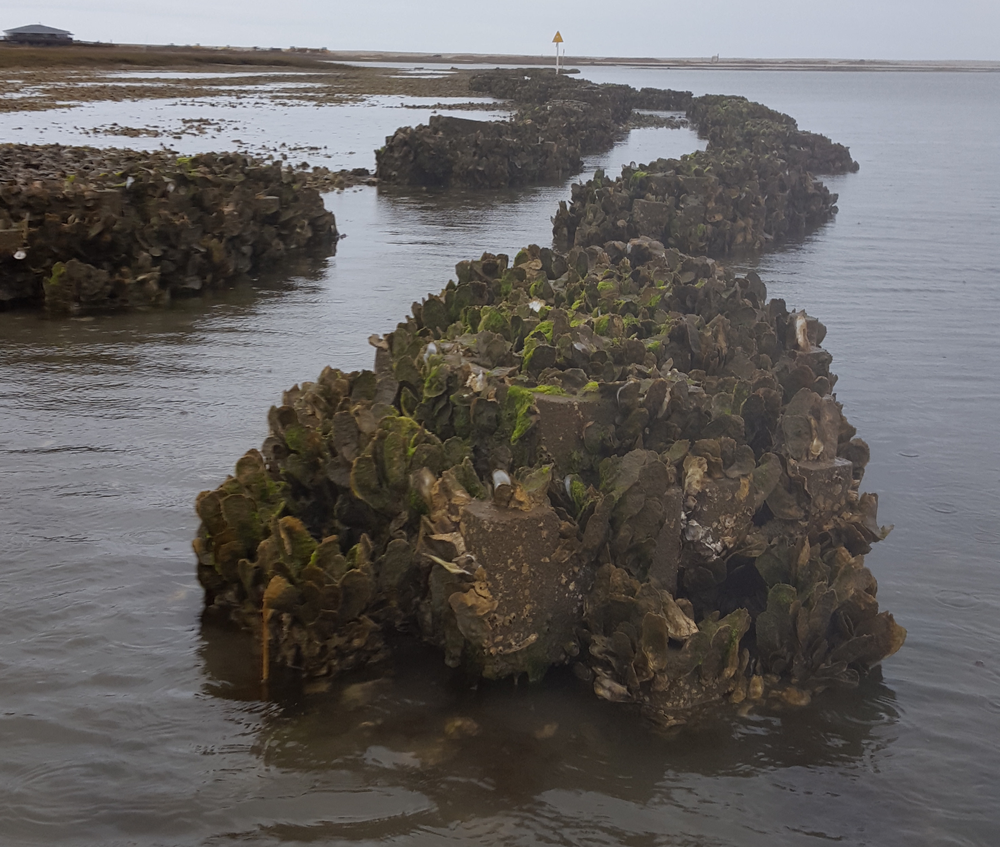

```{r setup, include=FALSE}
library("tidyverse");theme_set(theme_bw()) #used throughout.
library("infer") #may be needed for bootstrapping.
library("readxl") #read in data.

knitr::opts_chunk$set(cache = TRUE, autodep = TRUE, fig.height = 3.5, comment = "#")

knitr::knit_hooks$set(inline = function(x) { 
  
  # deal with pipe
  if(x == "%>%") return("\\verb|%>%|")
  if(length(grep("%>%", x)) > 0) {
    strings <- strsplit(x, " %>% ", fixed = TRUE)[[1]]
    knitted_strings <- vapply(strings, inline, character(1))
    return(paste(knitted_strings, collapse = " \\verb|%>%| "))
  }
  
  # work
  out <- paste0("{\\tt ", highr:::hi_latex(x), "}")
  out <- gsub("_", "\\\\_", out)
  out <- gsub("\\^", "\\\\string^", out)
  out <- gsub("\\$", "\\\\$", out)
  out <- gsub("&", "\\\\&", out)
  out
  
}) 

function_placeholder <- function() {
  f <- function(...) invisible()
  invisible(f)
}

object_placeholder <- function() invisible(NULL)

oyster<-read_xlsx("OysterRealData.xlsx")

```

# Introduction
Oyster reef habitats are a natural infrastructure that provide shoreline protection, enhancing shoreline resiliency and reducing storm hazards and threats to natural capital$^{[1][2][3][4][5]}$. However, over the past 300 years, native oyster populations in the Chesapeake Bay (Crassotrea virginica) have decreased to a small percent of the population at their peak existence$^{[6][7][8][9]}$. The degradation in population and habitat has reduced the ability of oyster reefs to provide ecosystem services.
Over the last 10 years, the Nature Conservancy, in collaboration with Allied Concrete, has developed the Oyster Castle® and installed man-made oyster reefs in multiple locations on the Virginia shoreline. These reefs are meant to help restore a depleted oyster habitat as well as provide a nature-based solution to improve shoreline resiliency under the looming threat of sea-level rise. Currently, there is little sufficient, specific research that exists examining the dynamics of oyster populations that would guide where to best place man-made oyster reefs. Thus, the Nature Conservancy was not able to plan the location and placement of the oyster reefs so that they might be most effective.
In addition to restoring habitat and improving water quality, the US Fish and Wildlife Service has goals to improve the avian community habitat in the Chesapeake Bay region. Specifically, the USFWS is targeting the Oyster Catcher bird (Haematopus palliates) which has been harmed by habitat change and a reduced oyster population. A more successful reemergence of a native oyster population would go lengths to promoting a reemergence of the Oyster Catcher.  
Generally, physiological and external stressors define distinct regions of optimal fitness conditions which, in turn, determine the distribution of a species$^{[1][10][11]}$. Thus, the effectiveness of using man-made oyster reefs to increase oyster population and protect shoreline depends in part on an understanding of the environmental factors that influence oyster recruitment and oyster density. Such recruitment and density are influenced primarily by two environmental factors: salinity and aerial exposure, the amount of time oysters are exposed during a tide cycle$^{[1]}$. This research quantitatively investigates specifically the effect of aerial exposure on oyster density on man-made oyster castles within Little Tom’s Cove, Chincoteague National Wildlife Refuge, Assateague Island, Virginia.

# Methods
Oyster data were collected at Little Tom's Cove, Chincoteague National Wildlife Refugre, Assateague Island, Virginia. Little Tom's Cove contains two groups of castles, one group (called A) sits at a slightly higher mean elevation and another group (called B) sits at a slightly lower mean elevation. Group A contains 110 castles in total and group B contains 70 castles in total. Eight castles were randomly sampled from each row (n=16) to guarentee both lower and higher aerial exposure rates and thus allow for a more robust analysis. 


{width=500px}


{width=500px}

{width=500px}

{width=500px}

\newpage

## Data Collection
Oyster density was calculated by counting the oysters by hand and using the surface area of the structure ($\rho=\frac{n}{SA}$, where n is number of oysters, SA is surface area, and $\rho$ is density). The oysters on the outer faces of the castles were counted from hundreds of close-up pictures taken on site. Becuase of the shape and growth on the oyster castles, only the easily visible portions of the castle were counted; the value for visable surface area where oysters were counted was calculated to be $2.5548 m^2$ for each castle. 
Since our study focuses on oyster density as a function of aerial exposure, we recorded water levels in the immediate vicinity of the castles with a Solinst Levelogger® Edge Model 3001 in tandem with a Solinst Barologger® Edge Model 3001. Salinity data was also recorded via the Levelogger®. The Levelogger® was placed in a stilling well and attached to the bay floor utilizing a grounded crate. The Barologger® was attached to a stable sign, 4 feet above water level, near group B. Measurements were automatically recorded at 15-minute intervals between April 6, 2018 and April 22, 2018. Reference height measurements were taken at each castle that have been included in the random sample to determine difference in height to the Levelogger®. Once the data was collected from the Levelogger®, the reference height measurements were used to adjust water level data to be accurate at each castle. The water level data were then converted to a percent aerial exposure rate.

```{r table , echo=FALSE}
knitr::kable(oyster[,c(1,2,3,4,6)], caption = "Sample Data from Field", col.names=c("Group","Castle ID", "Oyster Count", "Aerial Exposure", "Oyster Density"))
```

##Data Preparation
Data from the loggers and photos were compiled into a single spreadsheet. Data from loggers featured a lot of text data from which we extracted important values such as dates, times, and values. This data was used along with the reference measurements at each castle to determine if the castle was covered with water. At each 15-minute reading, the reference measure was used to determine the water level at the castle and then evaluated to see if the castle was in a "covered" state. We defined the covered state as a water level greater than or equal to $0.47m$, the height of the top of the third block on the castle. The covered states were counted and used in a proportion calculation, where the proportion is the proportion of readings for which the castle was in a covered state. In figure 1, the aerial exposure rates that were calculated are shown.

In a seperate file, the number of oysters were counted from the photos. For each castle 17 photos were taken: 4 perpendicular to each side and parallel with the gorund, 4 in line with the corners of the castle and parallel to the ground, 4 perpendicular to each side and at a 45 degree angle to the ground, 4 in line with the corners of the castle and at a 45 degree angle to the ground, and 1 from directly above. The visable surface area (VSA) where oysters were counted included any vertical sides on the exterior of the castle blocks and the tops of the castle blocks. The calculated VSA was $2.5548 m^2$. The photos were taken systematically to allow for organized counting at home, which could take place outside of what the tidal cycle allows for in person counting. 

These files were then joined to create the oyster dataset on which the analysis is conducted. 


# Analysis
## Population Parameters: Hypothesis Testing.
### Means
In order to proceed, it is important to test that the mean oyster density/oyster counts for each group are significantly different. If there is no significant growth difference between castle groups, then there is no argument to be made about where castles should be placed. Since the VSA of the castles in constant, only the oyster counts are variable for each castle. Our hypotheses are:

$$H_o: \mu_A = \mu_B$$

$$H_o: \mu_A \neq \mu_B$$


where $\mu$ is the mean number of oysters in the visable surface area of the castle. We use a significance level of 0.05 ($\alpha=0.05$). We then look at the group sample means as a point estimate. The sample means are:$\bar{x}_A = 1185.875$, $\bar{x}_{B} = 2053$. The difference between sample means is:$\bar{x}_A - \bar{x}_{B} = -867.125$.

```{r Sample Statistics, echo=FALSE, message=FALSE, warning=FALSE}
#Oyster Counts

##Sample Statistics
x_bar_A <- oyster %>% #get mean for near group.
  filter(location=="A") %>% 
  summarize(mean(oyster_count))

x_bar_B <- oyster %>% #get mean for far group.
  filter(location=="B") %>% 
  summarize(mean(oyster_count))

diff_xbar<-x_bar_B - x_bar_A #calculate difference in sample means.

#Plots of Data

oyster %>% 
  ggplot(aes(location,oyster_count,color=location)) + 
  geom_boxplot()+
  geom_jitter(alpha=0.4)+
  scale_color_brewer(type="qual", palette="Set1")+
  xlab("Location Group")+
  ylab("Oysters Counted in VSA")+
  labs(location="Group")+
  ggtitle("Figure 5: Boxplot of Oyster Castle Growth by Group") + 
  theme(legend.position = "none", text = element_text(family = "serif", size = 12))
```

Looking at the sample statistics: the means are fairly different, and the distributions seem to have little overlap (boxplot). Specifically, the mean of group B is much larger than group A, and since the distributions do not have much overlap, it appears that group A has lower growth than group B on average.

Small sample sizes lead us to utilize resampling methods along with traditional inferential procedures to confirm our results.

```{r t-Tests, echo=FALSE}
#t test for groups A and B, oyster counts.
ttest_means<- t.test(x=oyster$oyster_count[1:8] , y=oyster$oyster_count[9:16], paired=FALSE, mu=0 )
#test statistic.
t_stat<-ttest_means$statistic
#p-value.
t_stat_pval<-ttest_means$p.value
```
$$t = -5.692304$$

$$p \hspace*{0.1cm} value = 0.000149731$$ 

The t-test result, with a small p-value of 0.0001, we reject the null hypothesis; the means are significantly different at the $\alpha = 0.05$ level. To confirm that this conclusion is correct, we can compare with a permutation test.


```{r Permutation Testing: Means, echo=FALSE}
##Permutation Testing

#Means
set.seed(314)

obs_stat <- oyster %>%
  group_by(location) %>%
  summarise(x_bar = mean(oyster_count)) %>% 
  summarise(stat = diff(x_bar)) %>%
  pull()

perm_distribution <- 10000 %>% 
  rerun(oyster %>%
          mutate(location = sample(location))
        ) %>%
  map_dfr(~.) %>%
  mutate(replicate = rep(1:10000, each = 16)) %>% 
  group_by(replicate, location) %>% 
  summarise(x_bar = mean(oyster_count)) %>% 
  summarise(stat = diff(x_bar))

perm_distribution %>%
  ggplot(aes(stat)) +
  geom_histogram(binwidth = 50, color = "white") +
  geom_vline(xintercept = obs_stat, color = "red")+
  labs(x = "Calculated Statistic", y = "Count", title = "Figure 6: Permutation Test for Difference of Means for Groups A & B") + 
  theme(text = element_text(family = "serif", size = 12))

p_value <- perm_distribution %>% 
  summarise(mean(stat > obs_stat)) %>%
  pull()
p_value <- p_value*2

```
Again, we get a small p-value of 0.0002, so we reject the null hypothesis at the $\alpha=0.05$ level. Since the mean number of oysters for each castle group is significantly different, we can already begin to see why more castles should be placed in conditions similar to group B. 

### Variances
Now we can investigate the variances for each group. In analyzing the variances, we can hope to gain some insight about how stable a group's growth is.

Our test for variances is:

$$H_o: \sigma_A^2=\sigma_B^2$$

$$H_o: \sigma_A^2 \neq \sigma_B^2$$


Where $\sigma$ is the variance of oysters in the visable surface area of the castle. We use a significance level of 0.05. We then look at the group sample variances as a point estimate. The sample variances are: $\sigma_A^2 = 143323$, $\sigma_B^2 = 42319$. The ratio of the group sample variance is: $\frac{\sigma_A^2}{\sigma_B^2}=3.386724$.

```{r, echo=FALSE}
sig_sq_A<-oyster %>% #get sd for A group.
  filter(location=="A") %>% 
  summarize(var(oyster_count))

sig_sq_B<-oyster %>% #get sd for B group.
  filter(location=="B") %>% 
  summarize(var(oyster_count))

ratio_sigs<-sig_sq_A / sig_sq_B #calculate ratio of sample standard devs.

res_ftest<-var.test(x=oyster$oyster_count[1:8] , y=oyster$oyster_count[9:16], alternative="two.sided", conf.level=0.95)
```
Looking at the sample statistics: the variances are fairly different, and the spread of the distributions seems fairly different as well. In Figure 5, we see that the spread of the groups is different, where group B shows a much more consistent growth and group A has a much larger range of growth levels. However, the F-Test for variances, results in a p-value of 0.1299, so we fail to reject the null hypothesis. A type two error (a false negative) is where we conclude there is not a significant difference in variance but in reality there is a significant difference. To avoid a type II error, we can do a permutation test for the variances.

```{r Permutation Testing: Variance, echo=FALSE}
##Permutation Testing

#Means
set.seed(314)

obs_stat_2 <- oyster %>%
  group_by(location) %>%
  summarise(sig_sq = var(oyster_count)) %>% 
  summarise(stat = sig_sq[1]/sig_sq[2] ) %>% #Calculate sigma_A^2 / sigma_B^2
  pull()

perm_distribution_2 <- 10000 %>% 
  rerun(oyster %>%
          mutate(location = sample(location))
        ) %>%
  map_dfr(~.) %>%
  mutate(replicate = rep(1:10000, each = 16)) %>% 
  group_by(replicate, location) %>% 
  summarise(sig_sq = var(oyster_count)) %>% 
  summarise(stat = sig_sq[1]/sig_sq[2] )

perm_distribution_2 %>%
  ggplot(aes(stat)) +
  geom_histogram(binwidth = 0.1, color = "white") +
  geom_vline(xintercept = obs_stat_2, color = "red")+
  labs(x = "Calculated Statistic (F)", y = "Count", title = "Figure 7: Permutation Test for Ratio of Variances for Groups A & B") + 
  theme(text = element_text(family = "serif", size = 12))

p_value_2 <- perm_distribution_2 %>% 
  summarise(mean(stat > obs_stat_2)) %>%
  pull()
p_value_2<-p_value_2*2


```
In Figure 7, we see the count of instances in the permutation test that resulted in a calculated statistic value (F) of a given value. The red line in the figure is the calculated statistic for the samples. We are checking how rare is it that we observed this value.
 
 
Since the permutation test for variances resulted in a p-value=0.0254, we may have made a type II error in checking for equality of variances. The two conflicting tests leave a feeling of uncertainty, so a tie breaking test may be needed to provide more evidence that there is a significant difference. More sampling may also be needed to conclude if the variances of these groups is truly different. 


## Kernel Density Estimation

Looking into the population density curve can provide us with insights about our population(s). From the kernel density esitmation we see a slightly skewed bell-shaped distribution for the pooled data (Figure 8). Splitting the density curves by groups, it is noticable that group A has more spread than group B (consistnet with variance results) (see Figure 9). This suggests that group B may see more consistent growth amounts.

```{r Density Est, echo=FALSE}
#Run Kernel Density Estimation for each location.
oyster %>% 
  ggplot(aes(oyster_count))+
  geom_density()+
  scale_x_continuous(limits=c(0,3000))+
  labs(x = "Number of Oysters on VSA", y = "Density") +
  scale_color_brewer(type="qual", palette="Set1")+
  ggtitle("Figure 9: Kernel Density Estimation (Pooled Data)") + 
  theme(text = element_text(family = "serif", size = 12))

oyster %>% 
  group_by(location) %>% 
  ggplot(aes(oyster_count,color=location))+
  geom_density()+
  scale_x_continuous(limits=c(0,3000))+
  labs(x = "Number of Oysters on VSA", y = "Density")+
  scale_color_brewer(type="qual", palette="Set1")+
  ggtitle("Figure 8: Kernel Density Estimation by Location") +
  theme(legend.position = "bottom", text = element_text(family = "serif", size = 12)) 


```


## Polynomial Regression

We assume the relationship between oyster density and aerial exposure is unimodal. Thus a polynomial (non-linear least squares) regression is utilized to estimate parameters for the relationship. The equation $\hat{y}=-0.11077+2.9193x+799.8x^2$ is used, where $\hat{y}$ is the predicted oyster density given an aerial exposure rate, $x$. Invesitgating the residuals provides us with good confidence in our model as the residuals are roughly normal. The model suggests an optimal aerial exposure rate at $13.1773\%$ (shown as orange line in Figure 10). The optimal exposure rate is given by the vertex of the parabolic model. While Ridge et al.$^{[1]}$ found an optimal growth zone between 20-40%, they make mention that oysters at lower salinities may be better suited to lower rates of aerial exposure. Our results are consistent with this research. Additionally, salinity and temperature were recorded along with water level. Mean salinity over the two-week period was 25 psu (practical salinity units), categorizing the water in Little Tom’s Cove as polyhaline (for comparison, salinity in Ridge et al.$^{[1]}$ was 30-35 psu, euhaline). Mean temperature over the two-week period was 12.27. Because data were only collected from one site, any comparative analyses for differing salinity or temperature levels are not possible. 

 

```{r NLLS Model, echo=FALSE,mesage=FALSE}
fit1<-glm(oyster$oyster_dens ~ oyster$aer_exp + I(oyster$aer_exp ^ 2))
#summary(fit1)
oyster_pred<-cbind(oyster, predict(fit1, interval = 'confidence')) 
oyster_pred$fit<-oyster_pred$`predict(fit1, interval = "confidence")`
oyster_pred<-oyster_pred %>% #calculate residuals
  mutate(oyster_resid=oyster_dens-`predict(fit1, interval = "confidence")`)

fit_1 <- lm(oyster_dens ~ aer_exp + I(aer_exp ^ 2), data = oyster)
predictions <- predict(fit_1)
oyster_pred_2 <- bind_cols(as.data.frame(oyster), data.frame(predictions = predictions, residuals = fit_1$residuals))

# oyster_pred %>% 
# ggplot(aes(aer_exp,oyster_dens))+
#   geom_point(aes(color=location))+
#   geom_line(aes(aer_exp,fit))+
#   geom_vline(xintercept=13.1773, color="orange")+
#   scale_color_brewer(type="qual", palette="Set1")+
#   scale_x_continuous(limits=c(0,100))+
#   xlab("Aerial Exposure (% of day)")+
#   ylab("Oyster Density")+
#   ggtitle("Figure 10: Non-Linear Least Squares Model") + 
#   theme(legend.position = "bottom", text = element_text(family = "serif", size = 12))

oyster_pred_2 %>% 
 ggplot(aes(aer_exp,oyster_dens)) +
   geom_point(aes(color=location)) +
   geom_line(aes(aer_exp,predictions)) +
   geom_vline(xintercept=13.1773, color="orange") +
   scale_color_brewer(type="qual", palette="Set1") +
   scale_x_continuous(limits=c(0,100)) +
   xlab("Aerial Exposure (% of day)") +
   ylab("Oyster Density") +
   ggtitle("Figure 10: Polynomial Regression Model") + 
   theme(legend.position = "bottom", text = element_text(family = "serif", size = 12))
  
```

### Model Improvements and Important Context
According to the model, the upper zero growth bound is estimated to be 99.1657 percent aerial exposure. Location of a site which can serve as a sample of close to the 95 percent aerial exposure rate would improve the model. Since the model is assuming a unimodal relationship, there is assumed to be a point at which less aerial exposure becomes detrimental instead of beneficial. At another location, Greenbackville (see Figure 1), Innerst's model$^{[12]}$ predicted that the carrying capacity of the oyster castle would be reached as the castle's height relative to mean sea level increased. In our model this would imply that at close to the 50% exposure rate, it would be observed that a maximum density would be reached. Innerst's model, utilizing data collected at Greenbackville, suggests that aerial exposure and growth are directly related, whereas our model suggests that aerial exposure and growth are indirectly related. For these reasons, using data from both locations and modeling them in a similar fashion would greatly improve the accuracy of this model. Both models feature end behavior which is not fully explained using a singular location.


### Residual Analysis

Investigating the residuals provides us with good confidence in our model as the residuals are roughly normal. One of the assumptions of regression models is that the error terms of the model are normally distributed. Looking at Figure 11, we see the residiauls fit the normality line and do not fall outside of the confidence interval bands. The model was appropriate for the data.

```{r QQPLOT, echo=FALSE, message=FALSE}
#qqPlot(oyster_pred$oyster_resid, ylab="Normal Data Quantiles",xlab="Normal Theoretical #Quantiles",main="Figure 11: QQ-Plot for Residuals") #normality plot for residuals

library("qqplotr")

ggplot(data = oyster_pred_2, mapping = aes(sample = residuals)) + 
  stat_qq_line() + 
  stat_qq_point() + 
  stat_qq_band(alpha = 0.1) + 
  labs(x = "Theoretical Quantiles", y = "Sample Quantiles", title = "Figure 11: QQ-Plot for Residuals") + 
  theme(text = element_text(family = "serif", size = 12))


```

# Conclusion and Results
The national parks foundation which placed the castles should certainly consider placing more castles in similar conditions to group B in this study. Because group B displayed greater mean oyster counts with a slightly lower variance, the decision to place more castles in a group B setting would be better utilizing the resources the parks service has available. The better use of the Oyster Castle® resources would accelerate the return of this once populous species to the Chesapeake Bay area.

The polynomial regression method used to fit a second degree polynomial to the data proved to be successful. The unimodal relationship between aerial exposure and oyster density is a strongly supported hypothesis with the conclusion of this study. This conclusion would benefit from samples being taken from boundary condition reefs, that is, reefs that are submerged 5% of the time, or 95% of the time. These boundary conditions will aide in fitting the model to better represent the real world scenario. Sampling from the Greenbackville location may be helpful to the study, however it should be noted that these castles were assembled in a much different fashion (more akin to a sprawling lattice than a three teir castle). However, information about the reef population growth may still be useful as the Greenbackville site is subject to more aquatic predators than the Little Tom's Cove site. The next site chosen to further develop the study should be carefully chosen to have a similar water temperature and salinity to Little Tom's Cove, this way varibles are kept to a minimum and aerial exposure can remain the focus.

Future sites can be evaluated by the parks service by testing exposure rates at a site using a similar method as this study, thus preventing low growth installations like group A and better utilizing resources. 


\newpage
# References
1.	Ridge, J. T. et al. Maximizing oyster-reef growth supports green infrastructure with accelerating sea-level rise. Sci. Rep. 5, 14785; doi: 10.1038/srep14785 (2015).
2.	Piazza, B. P., Banks, P. D. & Peyre, M. K. La. The Potential for Created Oyster Shell Reefs as a Sustainable Shoreline Protection Strategy in Louisiana. Restor. Ecol. 13, 499–506 (2005).
3.	Scyphers, S. B., Powers, S. P., Heck, K. L. & Byron, D. Oyster reefs as natural breakwaters mitigate shoreline loss and facilitate fisheries. PLoS One 6, e22396 (2011).
4.	La Peyre, M. K., Humphries, A. T., Casas, S. M. & La Peyre, J. F. Temporal variation in development of ecosystem services from oyster reef restoration. Ecol. Eng. 63, 34–44 (2014).
5.	Cheong, S.-M. et al. Coastal adaptation with ecological engineering. Nat. Clim. Chang. 3, 787–791 (2013).
6.	Rothschild, B. J. et al. Decline of the Chesapeake Bay Oyster Population: a Century of Habitat Destruction and Overfishing. Marine Ecology Progress Series 111 (1/2), 29–39. (1994).
7.	Kirby, M. X. Fishing down the coast: historical expansion and collapse of oyster fisheries along continental margins. Proc. Natl. Acad. Sci. USA 101, 13096–9 (2004).
8.	Beck, M. W. et al. Oyster Reefs at Risk and Recommendations for Conservation, Restoration, and Management. Bioscience 61, 107–116 (2011).
9.	Zu Ermgassen, P. S. E. et al. Historical ecology with real numbers: past and present extent and biomass of an imperilled estuarine habitat. Proc. R. Soc./Biol. Sci. 279, 3393–400 (2012).
10.	Connell, J. H. Community Interactions on Marine Rocky Intertidal Shores. Annu. Rev. Ecol. Syst. 3, 169–192 (1972)
11.	Menge, B. A. & Sutherland, J. P. Community Regulation: Variation in Disturbance, Competition, and Predation in Relation to Environmental Stress and Recruitment. Am. Nat. 130, 730–757 (1987).
12. Innerst, Grant. Sustainability on the Half-Shell:Modeling Oyster Populations. Shippensburg University. (Unpublished, Senior Project, circa 2015).


